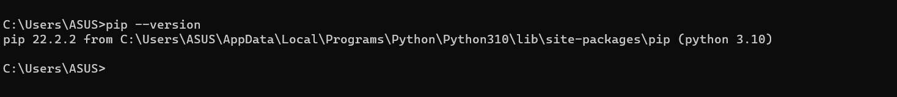
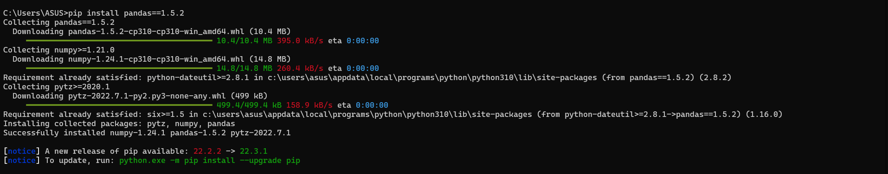
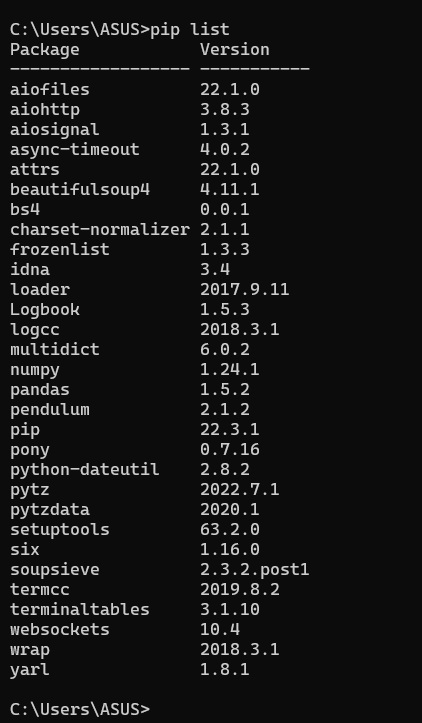
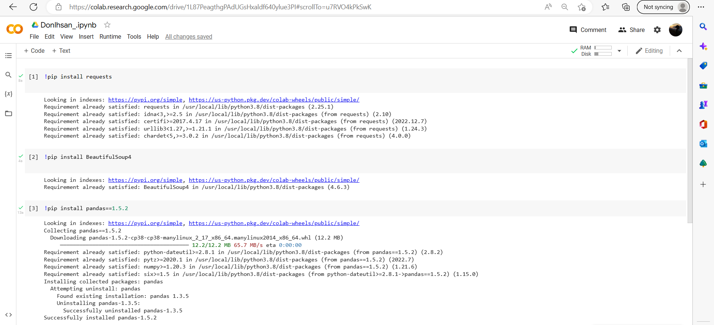
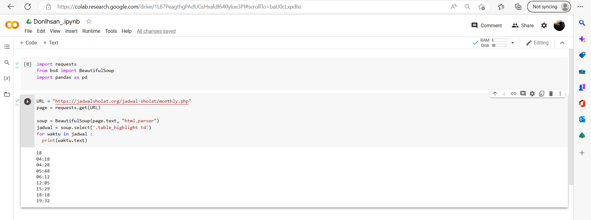

# Tugas Praktikum {Pertemuan ke 15}  

|**Nama**|**NIM**|**Kelas**|**Matkul**|
|----|---|-----|------|
|Muhammad Ikhsan Fakhrudin|312210019|TI.22.A2|Pemrograman|

# Python PIP

- PIP merupakan package manager untuk mengelola package dan modul pada python.
- Dengan menggunakan PIP, kita dapat menggunakan library yang tersedia bebas dari direktory package library python.
- Untuk dapat menggunakan PIP, perlu diinstall terlebih dahulu, silakan kunjungi tautan berikut untuk proses instalasinya : [Klik di sini](https://pypi.org/)

## Perintah Dasar PIP

- `pip --version ->` menampilkan versi PIP yang terinstall.

- `pip install nama_package ->` menginstall package.

- `pip uninstall nama_package ->` menghapus package.

- `pip list ->` untuk menampilkan daftar package yang terinstall.

# WEB Scraping Menggunakan Python 

### Introducing

- Data Scraping adalah suatu teknik dalam mengumpulkan data dari berbagai sumber data.
- Salah satunya adalah dari website, sehingga lebih dikenal dengan Web Scraping.
- Secara Umum ada dua teknik dalam Web Scraping yaitu Manual (copy paste), dan Otomatis (dengan software/tools).

### Teknik Web Scraping :

- Menyalin data secara manual
- Menggunakan regular expression
- Parsing data HTML
- Menggunakan DOM
- Menggunakan XPath
- Menggunakan Google Sheet

### Tools yang digunakan :
- Python
- Request
- BeautifulSoup
- Google Colab

# Studi Kasus

- [ !pip install requests ] digunakan untuk menginstall package requests di python. Package requests digunakan untuk melakukan HTTP request dari python.

- [ !pip install BeautifulSoup4 ] digunakan untuk menginstall package BeautifulSoup4 di python. Package BeautifulSoup4 digunakan untuk parsing dan mengelola data dari HTML atau XML.

- [ !pip install pandas ] digunakan untuk menginstall package pandas di python. Package pandas digunakan untuk memanipulasi data dalam bentuk tabel (dataframe) dan digunakan untuk data analysis. Fungsi dari package pandas sangat luas, seperti melakukan operasi pada data, mengimport dan mengeksport data dari berbagai format, dan lainnya.

- [ import pandas as pd ] digunakan untuk mengimport library pandas dan menyebutnya sebagai pd. Library pandas digunakan untuk memanipulasi data dalam bentuk tabel (dataframe) dan digunakan untuk data analysis.

- [ from bs4 import BeautifulSoup ] digunakan untuk mengimport class BeautifulSoup dari package BeautifulSoup4. Class BeautifulSoup digunakan untuk mengelola dan mengolah data dari HTML atau XML.

# Penjelasan Tambahan

Di sini saya mengambil contoh dengan mengambil data `Jadwal Sholat` dari situs Web [Jadwal Sholat 5 waktu](https://www.jadwalsholat.org/). Dengan menggunakan library Python 'requests', kodingan mengirim permintaan GET ke URL [Jadwal Sholat](https://jadwalsholat.org/jadwal-sholat/monthly.php) yang merupakan halaman web yang berisi informasi Jadwal waktu sholat. Kemudian, dengan menggunakan library 'BeautifulSoup', kodingan menganalisis konten halaman web yang didapat dari permintaan GET tersebut dengan menggunakan parser HTML.

Selanjutnya, kodingan mencari semua elemen HTML dengan atribut 'table_highlight td'. Kemudian, dari elemen-elemen tersebut, kodingan mengekstrak informasi seputar jadwal dan waktu sholat untuk wilayah Jakarta Pusat dengan mencari elemen yang memiliki atribut 'class' yang sesuai. Informasi yang diambil kemudian disimpan dalam sebuah list yang sesuai.

Setelah itu, kodingan menggunakan library pandas untuk membuat dataframe dari list yang didapat dan menyimpannya dalam variabel 'df'. Kemudian kodingan mencetak dataframe tersebut, sehingga kita dapat melihat informasi seputar jadwal dan waktu sholat untuk wilayah Jakarta Pusat dari situs Web [Jadwal Sholat](https://www.jadwalsholat.org/).

**Sekian Tugas Praktikum Saya di Pertemuan kali ini. Jika Masih Ada Yang Salah Saya Mohon Maaf.**

**Sampai Ketemu lagi di Semester Berikutnya.**

## Wassalamualaikum wr.wb.

